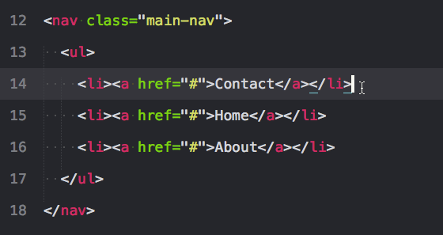

+ __Ctrl + D__ 选择一个选中项的下一个匹配项

    
    
+ **Alt + F3** 选择一个选中项的所有匹配

    
    
+ **Ctrl + Shift + M** 选择括号内的内容  

    
    
+ **Ctrl + Shift + ↑ 或 ↓** 上移下移当前行或选中行

    
    
+ **Ctrl + Shift + D** 复制行或选中行，如果你已经选中了文本,它会复制你的选中项。否则,把光标放在行上,会复制整行。

    
    
+ **Ctrl + [ 或 ]** 增加或减少缩进

    
    
+ **Ctrl + X** 剪切行

    

+ **Ctrl + Shift +V** 粘贴并保持缩进

    

+ **Ctrl + /** 注释选中行

     
    
+ **对齐插件AlignTab**
https://github.com/randy3k/AlignTab
